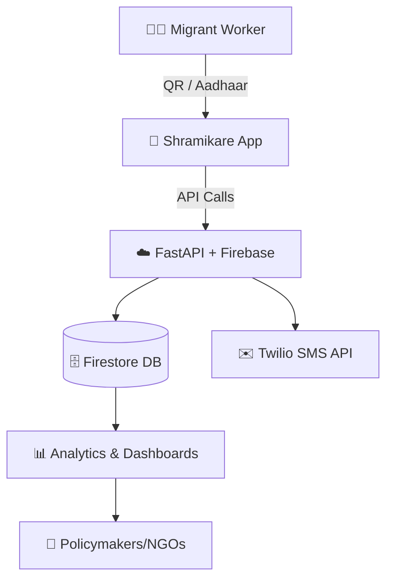

# SHRAMIKARE-FINAL# 
📌 Shramikare Green Health – Multilingual Digital Health Record System  

  
  
  
  
  
  

---

## 🌟 Overview  
**Shramikare Green Health** is a **Digital Health Record Management System** designed for **migrant workers in Kerala**, aligned with **SDG-3 (Good Health and Well-being)**.  

The platform ensures **portable, multilingual, and paperless medical records**, accessible via **QR codes, Aadhaar lookup, or SMS-based reminders**, empowering migrant workers with seamless healthcare access.  

---

## 🖼️ Screenshots & Demo  

👉 Replace these placeholders with actual screenshots or demo GIFs.  

### 🔹 Landing Page  
  

### 🔹 Multilingual Support  
  

### 🔹 Aadhaar Lookup & QR Scan  
  

### 🔹 Health Records Dashboard  
  

### 🔹 SMS Reminder Workflow  
  

---

## 🩺 Problem Statement  
- Migrant workers often lack **consistent health records** across states.  
- Paper-based systems are **prone to loss, duplication, and delays**.  
- **Language barriers** prevent workers from understanding health instructions.  
- Limited access to **feature phones & low connectivity** challenges inclusivity.  

---

## 💡 Our Solution  
- **Multilingual Mobile App** (Malayalam, Odia, Bengali, Assamese, Hindi).  
- **QR Code + Aadhaar Lookup** for instant access to health records.  
- **Offline-first caching** with sync on reconnection.  
- **Automated SMS reminders** for vaccinations, check-ups, and follow-ups.  
- **Secure cloud backend** for real-time health data availability.  
- **Analytics dashboard** for policymakers and NGOs.  

---

## 🔧 Tech Stack  

| Layer       | Technology |
|-------------|------------|
| **Frontend** | ⚛️ React.js, Tailwind CSS |
| **Backend**  | 🐍 FastAPI (Python), Express.js (Node) |
| **Database** | 🔥 Firebase Firestore |
| **Messaging** | 📩 Twilio SMS API |
| **Identity** | 🆔 Aadhaar (via Eko API) |
| **Analytics** | 📊 Python (Pandas), OpenAI API (optional) |

---

## ⚙️ System Architecture  



---

## 🚀 Features

* ✅ **Portable Records** → Access anywhere via Aadhaar or QR
* ✅ **Multilingual UX** → Supports 5+ regional languages
* ✅ **Inclusive** → Works on smartphones + feature phones
* ✅ **Offline-first** → Sync when network is back
* ✅ **Smart Alerts** → Automated SMS for due checkups
* ✅ **Analytics Dashboard** → Track outbreaks & public health

---

## 🔐 Security & Privacy

* Aadhaar integration with **user consent**.
* Role-based access for doctors, NGOs, and workers.
* Encrypted records stored in **Firestore**.
* Compliance with **Digital India Health Mission guidelines**.

---

## 📈 Impact & Benefits

* **Migrant Workers** → Portable, accessible, and understandable records.
* **Healthcare Staff** → Quick record lookup → faster treatment.
* **Government/NGOs** → Real-time data-driven insights.
* **Society** → Supports **Digital India, Atmanirbhar Bharat, Swachh Bharat**.

---

## 🛠️ Installation & Setup

```bash
# Clone the repo
git clone https://github.com/TAPANANSHUTRIPATHY/ShramikareGreenHealth.git
cd ShramikareGreenHealth

# Install dependencies
npm install

# Run development server
npm run dev
```

Backend setup (FastAPI + Firebase):

```bash
cd backend
pip install -r requirements.txt
uvicorn main:app --reload
```

---

## 📚 References

* [SIH 2025 Problem Statement](https://sih.gov.in/sih2025PS)
* [Firebase Firestore Docs](https://firebase.google.com/docs/firestore)
* [Twilio SMS API](https://www.twilio.com/docs/sms)
* [OpenAI Cookbook](https://github.com/openai/openai-cookbook)

---

## 👥 Team – **StellaRythm**

* **Tapananshu Tripathy**
* **Ujjwal Singh**
* **Shubham Kumar**
* **Hritika Shankhdhar**
* **Palak Singh**
* **Tejas Mahapatra**

---